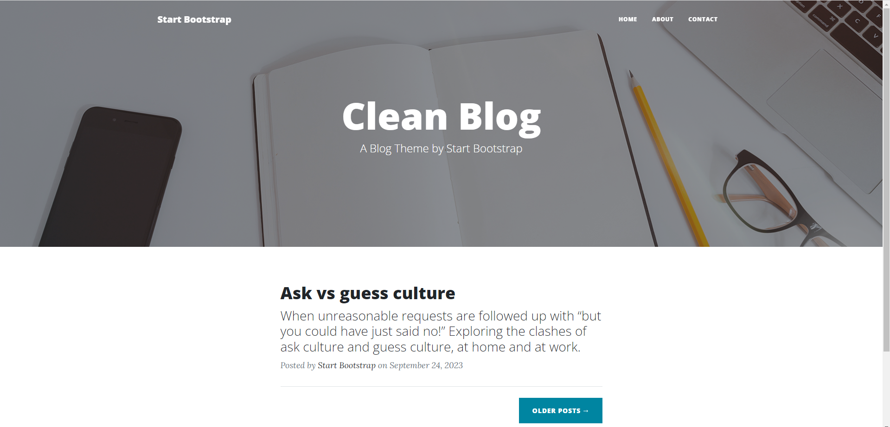
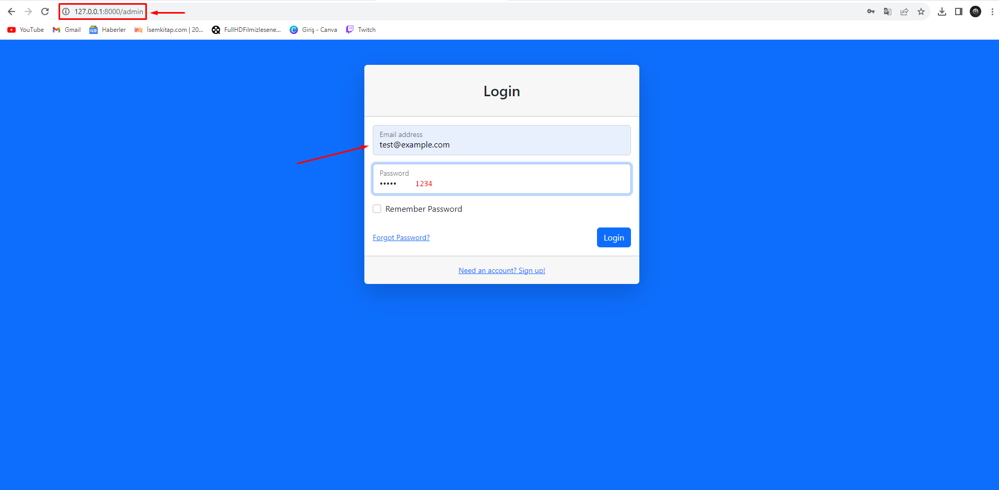
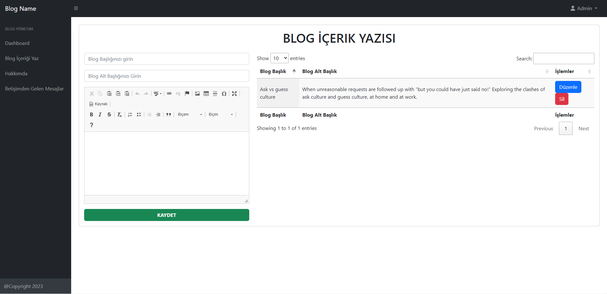
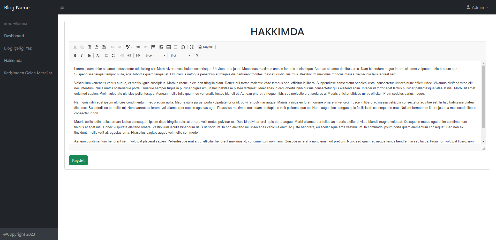

# Laravel + MySql + Blade Template Blog Project

Hello, I developed a blog project using Laravel and relational database MySql Technologies.

## Kurulum

Git ile projeyi clone edelim

```bash
git clone git@github.com:kodcubey/laravel-blog-blade.git
```

proje dosyamıza bashi kullanarak gidelim
ardından komutunu çalıştıralım

```bash
composer install
```

gerekli paketler kurulduktan sonra db configrasyonlarını sağlayalım
.env dosyasının içerisinde bulunan

```
DB_DATABASE=blog
```

komutunu sizin oluşturmuş olduğunuz bir db ile değiştirebilir veya blog adında yeni db oluşturabilirsin.

ardından db tablo ve veri işlenmesi için gerekli db configrasyonlarını çalıştırmaya başlayalım

```bash
php artisan migrate && php artisan db:seed
```

komutlarını çalıştırarak db configrasyonlarını sağlayalım.

projemizi

```bash
php artisan serve
```

komutunu çalıştırarak başlatalım;





